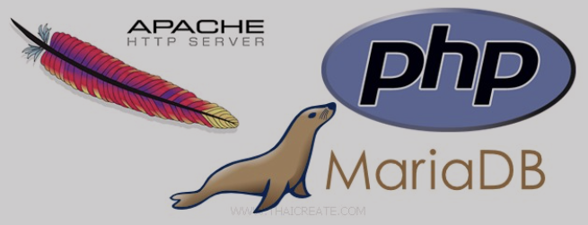

## Badges Projekt

## Projektet 

Det här projektet är ett kortspel som använder sig av objektorienterad PHP med ramverk symfony. Projektet innehåller klasser för grundläggande funktionalitet och kontrollklasser som på stort sätt utnyttjar grundklasserna för att skapa ett flöde. För style används css moduler.

Projektet är slutarbetet på en kurs objektorienterade webbteknologier inom webbprogrammering. I det här projektet har skapats en hel unittester också för vanliga klasser såsom för databaser och för kontrollklasser. Projektet använder sig av ORM också för att skapa databaser. En hel PHP-verktyg har också används genom projektet: phpmetrics, phpdoc, phpmd, phplint och integrerad scrutinizer. 

Projektet handlar om femkortspoker där fyra spelare kan spela femkortspoker. Två av spelarna är automatiserade: en kallas apa (en dum dator) medan en kallas computer (en smart dator). Två andra är människor där man har möjlighet av att betta och discarda kort för att få bästa hand som möjligt. 

## Klona projekt repo
Klona repot
- git clone https://github.com/Daudnaw/mvc
- cd mvc
Installera beroende
- Composer install
- npm install
Starta lokala servern: Kom igång med webplatsen
- symfony server:start

## Hur kommer man igång med att köra webplatsen
- To start the webbpage you go to bash
- You navigate to courese repo in this case `dbwebb-kurser/mvc/me/report`
- To start the server you run the command ` php -S localhost:8888 -t public  ` which starts the server
- Then you are ready to access the webbpage
- Mind you that after any changes in CSS or adding an images you have to `npm run build` so that your changes can be uppdated to public
